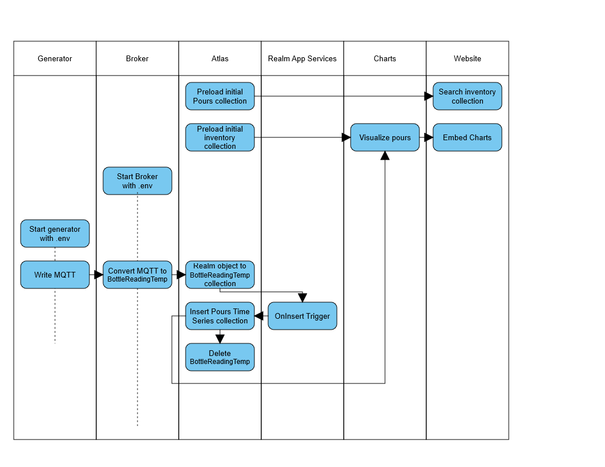

# Miami Hackathon Team4

_A simple (and fun!) way to look at an IOT use case._

# Background
The MongoDB Enterprise SA team would like to attend their next QBR in Aruba. However Mark needs to accurately account for liquor consumption during the trip.

To handle this, Team 4 has built the "MongoDBar" application. It allows for IOT-enabled liquor bottles to accurately record number of shots poured over time for each bottle in the bar.

# Components
* MongoDB **Atlas** for data retention
* MongoDB 5.0 **Time Series Collections** for measurements
* MongoDB **Realm** to allow the bottles to write offline-first readings and sync to Atlas
* Realm App Services **Triggers** to handle alerting, data movement, and inventory control
* MongoDB **Charts** for reporting
* HTML5/CSS/JS dashboard to allow for searching liquor inventory with **Atlas Search**
* **Realm Hosting** to store the dashboards

# Data
## Data models
### `Inventory` Sample Document

```
{
  "_id": {
    "$oid": "61780b85d28f5b8f68cb785b"
  },
  "Brand Label Serial Number": "5114712",
  "Brand Label Name": "TULLAMORE DEW 12 YR SPECIAL RES 80PF",
  "License Type Code": "652",
  "License Class Code": "2",
  "License Class Description": "WHISKEY",
  "Product Description": "IRISH WHISKY",
  "Wholesaler License Serial Number": "1263546",
  "Wholesaler Name": "WILLIAM GRANT & SONS INC",
  "Domestic (D) or Imported (I)": "I",
  "Brand Label Expiration Date": "2019-09-30T00:00:00.000",
  "volumeInOz": {
    "$numberDouble": "23.67"
  },
  "location": {
    "barName": "MooMba Beach Bar & Restaurant",
    "geo": [
      {
        "$numberDouble": "-70.05551129837323"
      },
      {
        "$numberDouble": "12.58224079198876"
      }
    ]
  }
}
```

### `Pours` Sample Document (Time Series)
```
{
  "pourTime": {
    "$date": {
      "$numberLong": "1633132583667"
    }
  },
  "bottle": {
    "Brand Label Name": "ARISTOCRAT LIQUEURS 30PF",
    "bottleId": {
      "$numberInt": "1092"
    }
  },
  "ouncesRemaing": {
    "$numberInt": "8"
  },
  "pourOunces": {
    "$numberInt": "2"
  },
  "_id": {
    "$oid": "61783ad464c23a581ed7ef4f"
  }
}
```

### `BottleReadingTemp` Realm Object
```
public class BottleReadingTemp : RealmObject
        {
            [PrimaryKey]
            [MapTo("_id")]
            public ObjectId Id { get; set; } = ObjectId.GenerateNewId();

            [MapTo("bottleId")]
            public string BottleId { get; set; }
            [MapTo("bottleContents")]
            public string Contents { get; set; }
            [MapTo("pourSize")]
            public int Pour { get; set; }
            [MapTo("remaining")]
            public int Remaining { get; set; }
        }
```

### `BottleReadingTemp` Sample Document
```
{
  "_id": {
    "$oid": "6178357fd660e7559ec86e52"
  },
  "_pk": "user=6178141d68f275f84ecafe2c",
  "bottleContents": "TULLAMORE DEW 12 YR SPECIAL RES 80PF",
  "bottleId": "8001",
  "pourSize": {
    "$numberLong": "1"
  },
  "remaining": {
    "$numberLong": "2"
  }
}
```

## Data flow


# Set up
## Prerequisites

* MongoDB Atlas Account
* IP Whitelist configured for API access
* Some knowledge of Realm and Charts


## Getting Started

After you configure your Atlas account set up your database by downloading inventory.json and put them into a database called 'mongodbar' and collection called 'inventory'.  Then add your IOT data using pours.json into the database called 'mongodbar' and collection called 'pours'......

ACTION AND DELETE : upload inventory.json and pours.json


### Set up Search

(
You need a search index for numerous reasons:
* exact names/spelling of beverages may not be known. 
* the bottle info was brought in in ALL CAPS.  Making typical searching cumbersome and error prone.  

).....


### Set up Trigger

.......


### Set up Charts


.......
